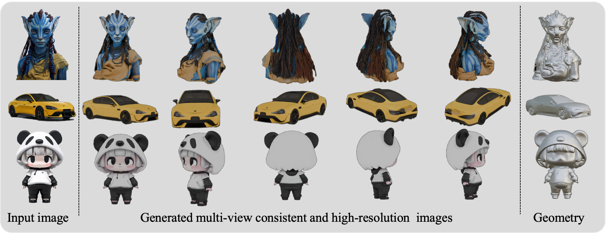
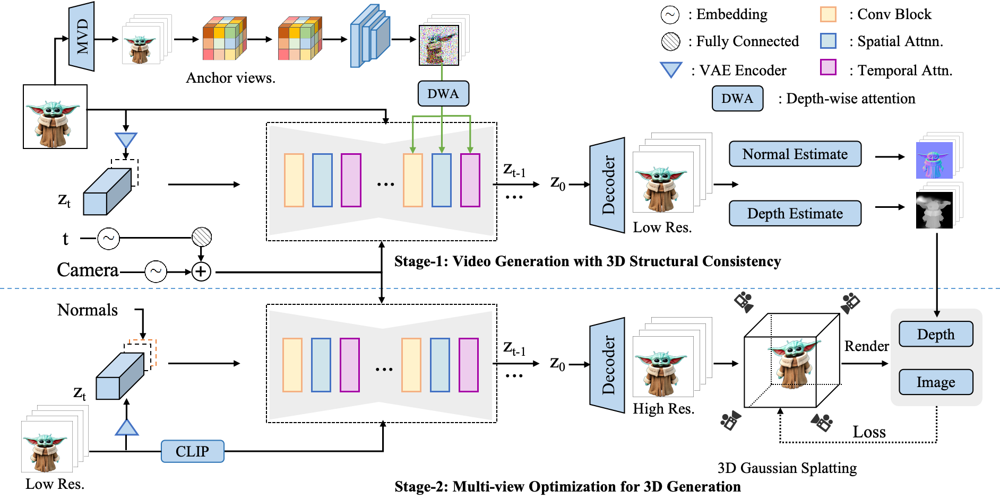

# Vid3D: High-Quality 3D Generation from Single-View Input via Optimized Video Prior

### [Project Page](https://imagebind-3d.github.io/imagebind3d/)  | [GitHub]() | [Paper]()

  

<figcaption style="text-align:justify; margin: 0 auto; display: table;">
We present Vid3D, a novel framework that repurposes video diffusion and 3D Structural priors for single-view 3D
generation, maintaining model efficiency and architecture integrity. In contrast to multi-view diffusion models (e.g., MVDream)
or iterative optimization techniques (e.g., DreamFusion), Vid3D delivers deterministic, high-quality meshes and novel views.
Crucially, our approach enables scalable 3D content creation by bridging video and 3D generative models.
</figcaption>

  

  

        
     
  

  

        
     
  

  

        
     
  

### Abstract

 Despite significant advancements in image-to-3D generation tasks, current methods frequently encounter challenges in maintaining consistent multi-view results, mainly due to their reliance on separately generated views using diffusion models, which inherently lack explicit 3D awareness. To address these limitations, we introduce Vid3D, an innovative \textbf{video diffusion-based 3D generation framework} that leverages \textbf{3D structural priors} to enhance \textbf{inter-view consistency} and improve overall \textbf{generation quality} from single-view inputs. Our proposed method is structured in two distinct stages.  \textbf{In the first stage}, we first fine-tune the video diffusion model to generate 3D surround videos.
 We then propose a multi-view generation algorithm based on 3D structural priors to enhance inter-view consistency across frames in the surround video.
 \textbf{In the subsequent stage}, we introduce a normal-guided video-to-video super-resolution module to generate high-resolution surround videos and enhance fine-grained texture details. The optimized high-resolution video is then fed into 3D Gaussian Splatting (3DGS) for multi-view reconstruction. Extensive experiments conducted on various benchmark datasets demonstrate that Vid3D significantly outperforms existing state-of-the-art techniques, exhibiting superior performance in terms of multi-view consistency, visual fidelity, and detailed 3D reconstructions.

### Approach

<figcaption style="text-align: justify;">To mitigate the viewpoint inconsistency issue in image-based 3D generation tasks, we propose Vid3D, a video diffusion-based 3D generation method, as shown in Figure. In our approach, we first enhance multi-view consistency using 3D geometric priors. In the second stage, we introduce a video-to-video super-resolution module to provide richer details for each video frame. 
This section is organized as follows: we begin by detailing our finetuning strategy for generating surround-view videos(Section 4.1). We then introduce the 3D structural prior injection module designed to enhance view consistency(Section 4.2). Lastly, we describe the video-to-video super-resolution module, which further improves the visual quality(Section 4.3).</figcaption>
  

### More results

  

  

        
     
  

  

        
     
  

  

        
     
  

### Text-guidied 3D generation
